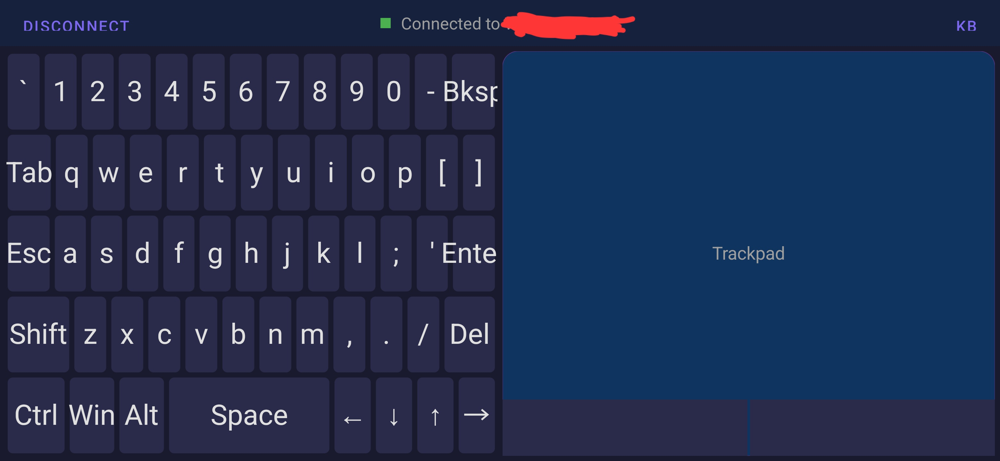
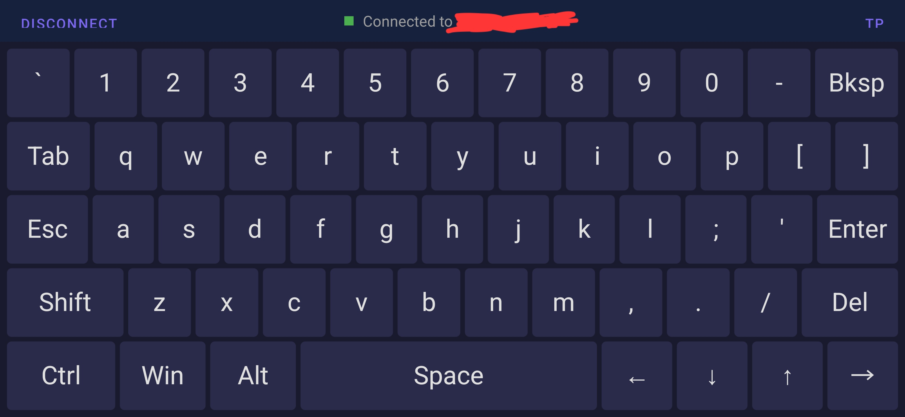

# GhostBoard

Use your Android phone as a wireless Bluetooth mouse trackpad and keyboard for your PC. No server, no drivers, no app needed on the PC side — your phone connects directly as a standard Bluetooth HID device.

Built for the couch, the bed, or anywhere you want to control your PC without reaching for a physical keyboard and mouse.

<p align="center">
  
</p>

## Screenshots

| Keyboard + Trackpad | Full Keyboard |
|---|---|
|  |  |

## Features

- **Bluetooth HID** — Connects directly to your PC as a standard keyboard and mouse. No companion app or server needed on the PC.
- **Trackpad** — Single finger drag to move the mouse. Tap to left-click. Two-finger tap to right-click. Two-finger drag to scroll.
- **Compact Keyboard** — Full QWERTY layout with numbers, symbols, modifiers (Shift, Ctrl, Alt, Win), arrow keys, Esc, Tab, Enter, Backspace, and Delete.
- **Dedicated Mouse Buttons** — Left and right click buttons at the bottom of the trackpad. Hold left click and drag on the trackpad to move windows.
- **Click-and-Drag** — Button state is preserved during mouse movement, so dragging windows and selecting text works properly.
- **Fullscreen Keyboard** — Toggle button to expand the keyboard to full screen for easier typing, then switch back to split view.
- **Sticky Modifiers** — Tap Ctrl, then tap a key for combos like Ctrl+C. Tap Win alone to open the Start menu.
- **Auto-Reconnect** — Remembers your last connected device and reconnects automatically when you reopen the app.
- **Dark Theme** — Easy on the eyes for use in low-light environments.
- **Idle Wake-Up** — Sends a wake-up pulse after inactivity so the first input after idle isn't delayed by Bluetooth sniff mode.
- **Optimized Input** — Mouse reports are throttled and sent on a dedicated background thread to minimize lag and keep the UI responsive.

## Requirements

- Android 9+ (API 28) — required for the Bluetooth HID Device API
- A PC with Bluetooth that supports HID input devices (most do)

## Setup

1. **Build the APK** — Open the project in Android Studio, sync Gradle, and run on your phone. Or build from the command line:
   ```
   ./gradlew assembleDebug
   ```
   The APK will be at `app/build/outputs/apk/debug/app-debug.apk`.

2. **Pair your phone with your PC:**
   - Open GhostBoard on your phone
   - Tap **Connect** > **Make Discoverable**
   - On your PC, go to Bluetooth settings and add a new device
   - Select your phone and pair

3. **Use it** — Once connected, the trackpad and keyboard are live. Minimize the app and reopen anytime — it auto-reconnects.

## How It Works

GhostBoard uses Android's [BluetoothHidDevice](https://developer.android.com/reference/android/bluetooth/BluetoothHidDevice) API to register your phone as a Bluetooth HID (Human Interface Device) combo device. It presents standard HID report descriptors for a keyboard and mouse, so the PC sees it as a regular input device — no special drivers or software needed.

## Project Structure

```
app/src/main/java/com/example/remoteinput/
  MainActivity.kt              — Main activity, UI setup, connection flow
  bluetooth/
    BluetoothHidManager.kt      — Bluetooth HID registration, connection, report sending
  ui/
    TrackpadView.kt             — Touch trackpad with move, tap, scroll, two-finger gestures
    CompactKeyboardView.kt      — Custom-drawn QWERTY keyboard with HID keycodes
```

## Credits

- **App Icon** — Created by [OpenAI ChatGPT](https://chatgpt.com) (image generation)
- **Code** — Built with [Claude Code](https://claude.ai/code) by Anthropic

## License

MIT License — see [LICENSE](LICENSE) for details.
